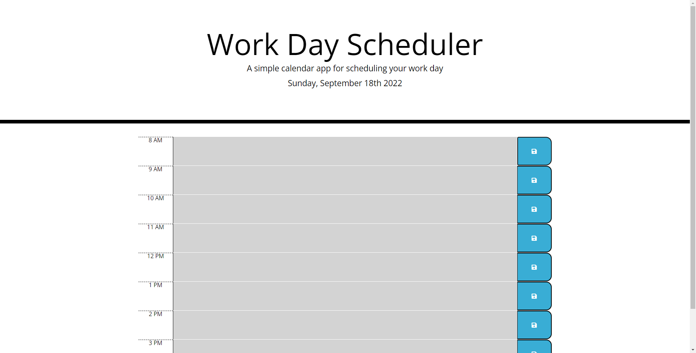

# Work-Day-Scheduler

## Description

A work day application that allows users to save events for each hour of the day and is color-coded depending on current time.

## Links

[Deployed Website]()

[Repository]()

## Installation

N/A

## Usage

Each time block is color-coded depending on whether it is in the past, present, or future. The past will show as grey, present will be red, and future will be green. 
The user will be able to enter text in each time block and save it by clicking on the save button located on the right hand side. The information is saved in local storage of the user.

## Credits

[W3Schools](https://www.https://www.w3schools.com/)

[YouTube](https://www.youtube.com/)

[MDN](https://developer.mozilla.org/en-US/)

